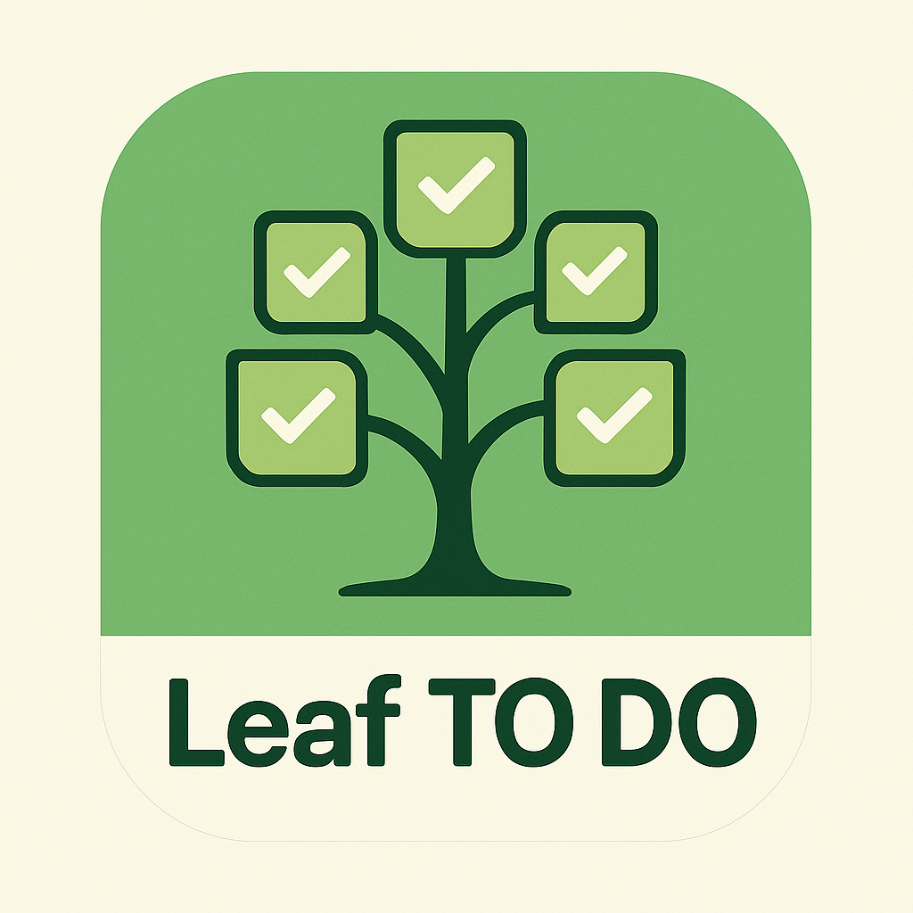

In this project, we have created a simple task application using JavaFX. The app allows users to add, delete, mark tasks as completed, and classify tasks into different categories.

### Built With

This project was built using the following technologies:

- [JavaFX](https://openjfx.io/)
- [Jfoenix](https://mvnrepository.com/artifact/com.jfoenix/jfoenix/9.0.1)
- [Maven](https://maven.apache.org/)
- [Scene Builder](https://gluonhq.com/products/scene-builder/)
- [IntelliJ IDEA](https://www.jetbrains.com/idea/)
- [GitLab](https://gitlab.com/)
- [Git](https://git-scm.com/)
- [SQL Server](https://www.microsoft.com/en-us/sql-server/sql-server-2019)

## Getting Started

You can clone the project and run it using the following commands:

```bash
git clone 
cd db2-team-
mvn clean javafx:run
```
 
### Prerequisites

You need to have the following installed on your machine:
- Java 9 or later
- Jfoenix library
 
## Authors
The authors of this project are:

- [Omar Suaréz](https://gitlab.com/OmarNmb)
 
<!--End of readme-->

